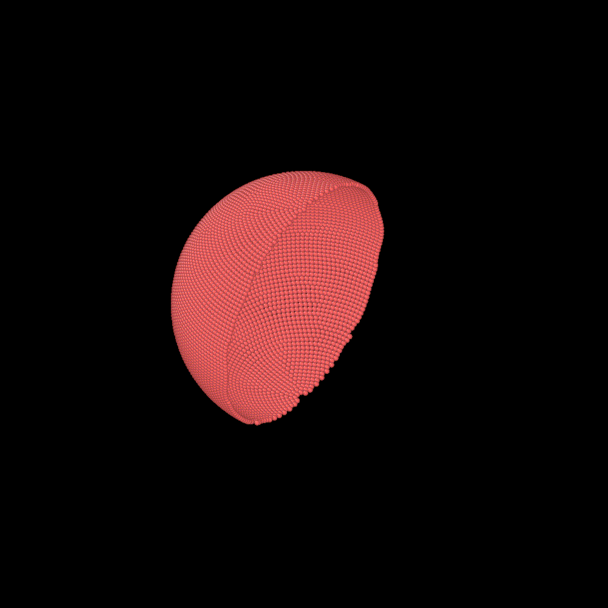

# CGNS: Coarse-Grained Nucleus Simulator

CGNS is being developed for simulating a coarse-grained model of the mammalian
nucleus. So far, the planar membrane in CGNPS is converted to spherical shape
(see below). Next, the filament generation will be converted from normal
orientation to radial orientation. Similarly, the deposition walls will be made 
spherical, growing like a temporary bubble to deposit the filaments to form the
nuclear lamina.



### Dependencies
1. LAMMPS \
Steve Plimpton, Fast Parallel Algorithms for Short-Range Molecular Dynamics,
J Comp Phys, 117, 1-19 (1995). https://doi.org/10.1006/jcph.1995.1039 \
Website: https://lammps.sandia.gov

2. Fluidmembrane Package \
Fu, S.-P., Peng, Z., Yuan, H., Kfoury, R., Young, Y.-N. (2016),
Lennard-Jones type pair-potential method for coarse-grained lipid bilayer
membrane simulations in LAMMPS, Mendeley Data, V1,
https://doi.org/10.17632/4v53nkv5hc.1 \
Website: https://doi.org/10.17632/4v53nkv5hc.1

3. NumPy for Python 3 \
Harris, C.R., Millman, K.J., van der Walt, S.J. et al. Array programming with
NumPy. Nature 585, 357–362 (2020). https://doi.org/10.1038/s41586-020-2649-2 \
Website: https://numpy.org

4. Pizza.py Toolkit \
Website: https://lammps.github.io/pizza/

### Setup
1. Please refer to the website for installation instructions of the above 4
   dependencies.
2. The original pair_fluidmembrane.cpp in Fluidmembrane dependency will need a
   few modifications to make it compatible with the new LAMMPS versions.

### Usage
Step 1: Assemble the nucleus.

        The assembly module is used to generate and assemble the structure. A
        new user would start by reproducing the animation above.

### Development

With following steps you can submit fixes for open issues or you can open a new
issue and submit fix for it:

```shell
# Fork this repository with the Fork button on top right
# Clone it to your local system
git clone https://github.com/<YourUserName>/CGNS.git
# Make a new branch with issue number (e.g. 1) as branch name
git checkout -b 1
# Create a new remote for this upstream repo
git remote add upstream https://github.com/mechbio/CGNS
# Make your changes
...
# Stage them and commit with the issue tag (i.e. #1 for issue number 1)
git add .
git commit -m "fixes #1"
# Push it back to your repo
git push -u origin 1
# Click the Compare & pull request button at github.com/<YourUserName>/CGNS
# Click Create pull request to open a new pull request.
```

### Questions, Comments, Clarifications, Requests

Please use the Discussions tab. It'll be nice if you can introduce yourself to everyone in the Welcome thread.
